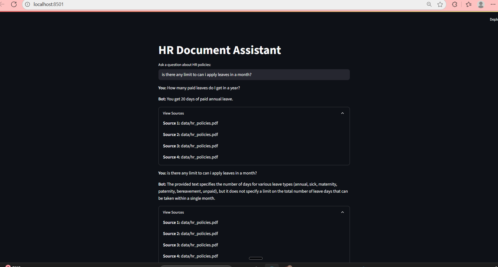

# 🧾 HR Document Assistant

A Generative AI-powered HR Knowledge Assistant that can answer HR policy questions from your internal documents.

This project demonstrates a Retrieval-Augmented Generation (RAG) pipeline with LangChain, FAISS, and Streamlit, capable of:

1. Multi-turn conversations with memory

2. Answering queries over PDF HR policies

3. Providing source documents for traceability

## Project Screenshot



## Features

- Conversational Q&A – Ask HR-related questions in natural language

- RAG (Retrieval-Augmented Generation) – Uses FAISS vector DB to ground LLM answers in documents

- Memory-enabled – Maintains chat history in multi-turn conversations

- Source Document Display – Shows which HR document was used for the answer

- Streamlit UI – Clean, interactive web interface

## Tech Stack

- Python 3.10+

- LangChain – ConversationalRetrievalChain + Memory

- FAISS – Vector database for semantic search

- Google Gemini / OpenAI LLMs – For answer generation

- Streamlit – For web-based UI

## Folder Structure
├── app.py
├── rag_chain.py
├── ingest.py
├── llm.py
├── data/
│ └── hr_policies.pdf
├── faiss_index/
│ ├── index.faiss
│ └── index.pkl
├── .env
└── requirements.txt

## Run Locally
```bash
pip install -r requirements.txt
streamlit run app.py 
```

## Use Case
```
HR teams can deploy this assistant to reduce repetitive queries from employees. It responds to policy-related questions in a natural language format with citation-based evidence.
```
## Future Improvements

- Highlight relevant PDF text snippets in the answer

- Support multiple HR document types (Excel, Word)

- Deploy on Streamlit Cloud or Render

