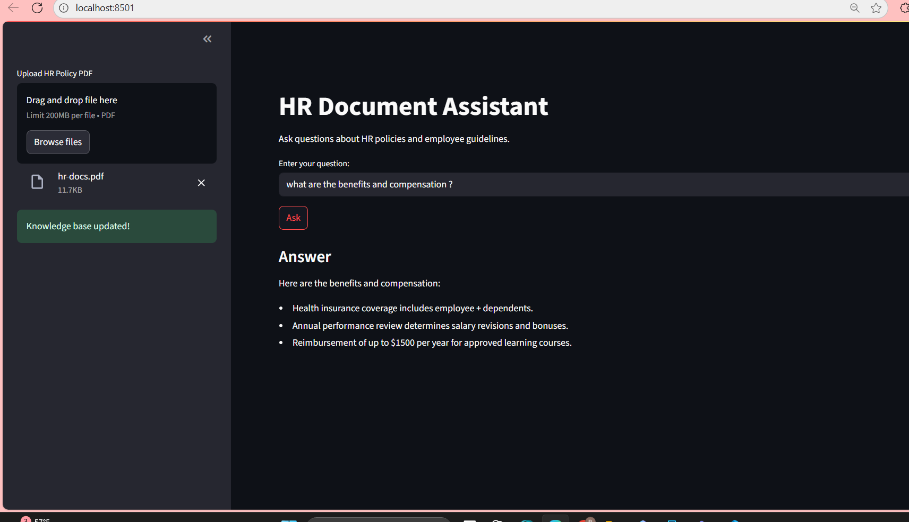

# 🧾 HR Document Assistant

A Retrieval-Augmented Generation (RAG) chatbot that answers HR-policy questions
using company documents as context.

## Project Screenshot



## Features

- Conversational Q&A – Ask HR-related questions in natural language

- RAG (Retrieval-Augmented Generation) – Uses FAISS vector DB to ground LLM answers in documents

- Memory-enabled – Maintains chat history in multi-turn conversations

- Source Document Display – Shows which HR document was used for the answer

- Streamlit UI – Clean, interactive web interface

## Tech Stack

- Python 3.10+

- LangChain – ConversationalRetrievalChain + Memory

- FAISS – Vector database for semantic search

- Google Gemini / OpenAI LLMs – For answer generation

- Streamlit – For web-based UI

## Folder Structure
hr-assistant/
│
├── app.py
├── backend/
│   ├── ingest.py
│   ├── llm.py
│   └── rag_chain.py
├── data/
│   └── hr_policies.pdf
├── screenshots/
│   └── hr_bot_demo.png
├── requirements.txt
├── .env.example
└── README.md

## Run Locally
```bash
pip install -r requirements.txt
streamlit run app.py 
```
## 🌐 Demo
*(add your Streamlit Cloud or Hugging Face Spaces link)*

## Use Case
```
HR teams can deploy this assistant to reduce repetitive queries from employees. It responds to policy-related questions in a natural language format with citation-based evidence.
```
## Future Improvements

- Highlight relevant PDF text snippets in the answer

- Support multiple HR document types (Excel, Word)

- Deploy on Streamlit Cloud or Render

